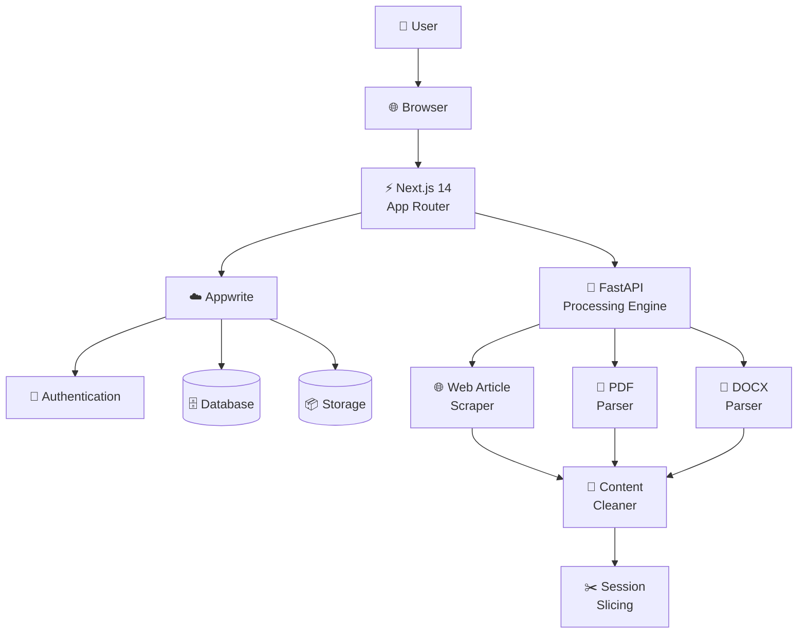
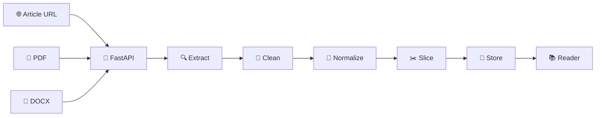
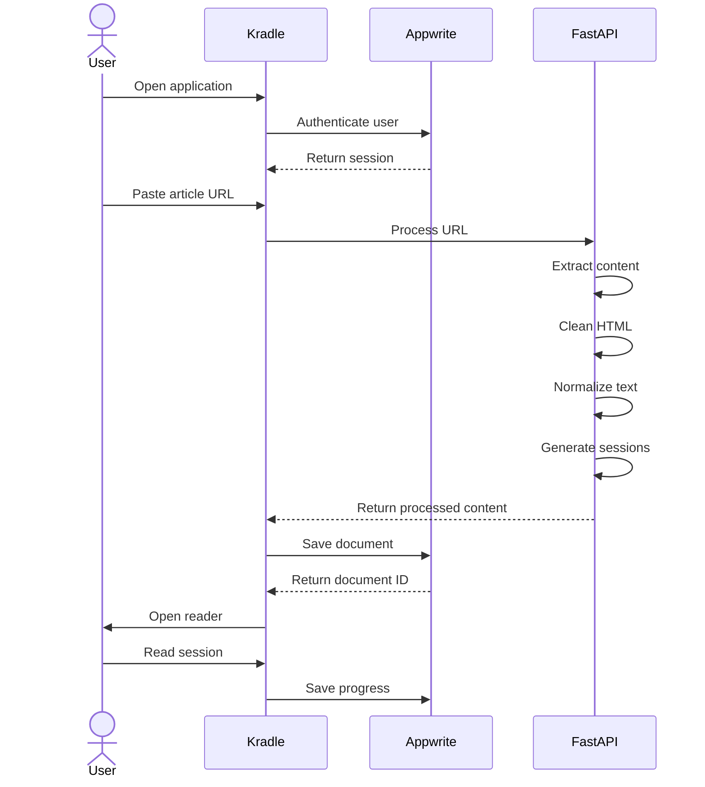

<div align="center">

# 📖 Kradle

### *A calmer place to read.*

**An ergonomic, distraction-free multi-format reading platform designed for focused long-form reading.**

<br>

[](https://nextjs.org/)
[](https://fastapi.tiangolo.com/)
[](https://appwrite.io/)
[](https://tailwindcss.com/)
[](https://www.python.org/)
[](LICENSE)

<br>

[✨ Features](#-features) •
[🏗 Architecture](#-system-architecture) •
[📖 Reader](#-the-reading-experience) •
[🚀 Setup](#-getting-started) •
[🗄 Database](#-database-schema) •
[🌿 Git](#-git-workflow)

</div>

---

<div align="center">

> **The web is built to make you scroll.**
> **Kradle is built to help you read.**

</div>

---

## 📌 About The Project

**Kradle** is a modern multi-format reading platform built around one simple idea:

> **Digital reading should feel as comfortable as opening a good book.**

The modern web is full of advertisements, pop-ups, cookie banners, distracting sidebars, inconsistent typography, and endless scrolling.

Kradle removes that noise and turns digital content into a focused reading experience.

It supports:

* 🌐 Web article URLs
* 📄 PDF documents
* 📝 DOCX documents
* 🌍 English content
* اردو **Urdu / RTL content**

The platform extracts and normalizes content, applies customizable typography, and divides long-form material into manageable reading sessions.

The name **Kradle** is inspired by the traditional *cradle / lectern* used to hold and elevate books for a more comfortable reading posture.

Kradle applies that philosophy to digital reading:

**Elevate the content. Remove the clutter. Focus on the words.**

---

# ✨ Features

## 🧹 Distraction-Free Reader Canvas

Transform cluttered web content into a clean reading environment.

* Removes unnecessary page elements
* Focuses on the main article content
* Optimized reading width
* Comfortable line lengths
* Clean typography
* Minimal visual distractions

The reader canvas intentionally keeps the content narrow and readable instead of stretching text across the entire screen.

---

## ✂️ Smart Session Slicing

Long documents can feel overwhelming when presented as one massive block.

Kradle automatically divides long-form content into realistic reading sessions.

### Session Flow

```text
┌──────────────────────────┐
│       FULL ARTICLE       │
│                          │
│     20,000+ words        │
└────────────┬─────────────┘
             │
             ▼
      ✂️ SESSION SLICER
             │
     ┌───────┼───────┐
     ▼       ▼       ▼
   10–15   10–15   10–15
   mins    mins    mins
     │       │       │
     ▼       ▼       ▼
 Session  Session  Session
   01       02       03
```

Each session provides a natural checkpoint so readers can stop and return later without losing their place.

---

## 🌍 Native English + Urdu Typography

Kradle treats multilingual reading as a first-class feature.

### English

Supported reading fonts include:

* Literata
* Merriweather
* Inter

### Urdu

Kradle supports:

* Noto Nastaliq Urdu
* Right-to-left text direction
* RTL-aware layouts
* Native Urdu typography
* Comfortable Nastaliq rendering

Example:

```text
English

Knowledge becomes meaningful
when we make time to understand it.


اردو

علم اس وقت بامعنی بنتا ہے
جب ہم اسے سمجھنے کے لیے وقت نکالتے ہیں۔
```

---

## 🎨 Four Ergonomic Display Themes

Kradle provides four reading environments.

| Theme            | Description                    |
| ---------------- | ------------------------------ |
| 📄 **Paper**     | Clean light reading mode       |
| 🟤 **Sepia**     | Warm, book-inspired appearance |
| 🌑 **Charcoal**  | Soft dark reading mode         |
| ⚫ **OLED Black** | True black dark mode           |

Readers can switch between themes depending on their environment and preference.

---

## 🔤 Advanced Typography Controls

Reading should adapt to the reader.

Kradle provides controls for:

* Font family
* Font size
* Line spacing
* Reading theme
* Text direction
* Language-specific typography

---

## 📚 Unified Library

All reading material lives in one place.

```text
                    📚 KRADLE LIBRARY
                           │
             ┌─────────────┼─────────────┐
             │             │             │
             ▼             ▼             ▼
         🌐 Articles    📄 PDFs       📝 DOCX
             │             │             │
             └─────────────┼─────────────┘
                           │
                           ▼
                    📖 Reader Canvas
                           │
                           ▼
                    📊 Reading Progress
```

Users can:

* Import articles
* Upload documents
* Search their library
* Track reading progress
* Resume previous sessions
* Manage reading preferences

---

# 🧠 The Philosophy

Kradle is not designed to make users consume **more** content.

It is designed to make reading **more intentional**.

### Traditional Web Reading

```text
Website
   │
   ├── Advertisements
   │
   ├── Pop-ups
   │
   ├── Cookie banners
   │
   ├── Sidebars
   │
   ├── Related articles
   │
   ├── Notifications
   │
   └── Infinite scrolling
              │
              ▼
         😵 Distraction
```

### Kradle

```text
Web / PDF / DOCX
       │
       ▼
Content Extraction
       │
       ▼
Content Cleaning
       │
       ▼
Text Normalization
       │
       ▼
Typography Engine
       │
       ▼
Session Slicing
       │
       ▼
Focused Reading
       │
       ▼
       📖
```

---

# 🏗 System Architecture

Kradle uses a decoupled architecture separating the frontend, application services, and Python processing engine.



---

# 🔄 Content Processing Pipeline

Every imported document passes through the processing pipeline.



---

# 📖 The Reading Experience

The reader is built around three things:

```text
              ┌─────────────────────┐
              │     KRADLE READER   │
              └──────────┬──────────┘
                         │
          ┌──────────────┼──────────────┐
          │              │              │
          ▼              ▼              ▼
      📖 Content      🎨 Controls    📊 Progress
          │              │              │
          │              ├── Theme       │
          │              ├── Font        │
          │              ├── Size        │
          │              └── Spacing     │
          │                             │
          └─────────────────────────────┘
```

The interface stays secondary.

The content stays primary.

---

# 🎨 Reading Themes

## 📄 Paper

A clean, traditional document-like reading environment.

```text
┌─────────────────────────────────────┐
│                                     │
│              PAPER                  │
│                                     │
│     Clean • Light • Familiar        │
│                                     │
└─────────────────────────────────────┘
```

---

## 🟤 Sepia

A warmer environment inspired by physical books.

```text
┌─────────────────────────────────────┐
│                                     │
│              SEPIA                  │
│                                     │
│       Warm • Soft • Book-like       │
│                                     │
└─────────────────────────────────────┘
```

---

## 🌑 Charcoal

A softer dark reading environment.

```text
┌─────────────────────────────────────┐
│                                     │
│            CHARCOAL                 │
│                                     │
│          Soft Dark Mode             │
│                                     │
└─────────────────────────────────────┘
```

---

## ⚫ OLED Black

A true-black reading environment.

```text
┌─────────────────────────────────────┐
│                                     │
│               OLED                  │
│                                     │
│          True Black Mode            │
│                                     │
└─────────────────────────────────────┘
```

---

# ✂️ Smart Session Slicing

Instead of forcing users through one enormous document:

```text
ONE MASSIVE DOCUMENT

██████████████████████████████████████
██████████████████████████████████████
██████████████████████████████████████
██████████████████████████████████████
██████████████████████████████████████
██████████████████████████████████████
```

Kradle turns it into:

```text
┌─────────────────────────┐
│       SESSION 01        │
│                         │
│        ~10–15 min       │
└────────────┬────────────┘
             │
             ▼
┌─────────────────────────┐
│       SESSION 02        │
│                         │
│        ~10–15 min       │
└────────────┬────────────┘
             │
             ▼
┌─────────────────────────┐
│       SESSION 03        │
│                         │
│        ~10–15 min       │
└────────────┬────────────┘
             │
             ▼
           ...
```

This creates natural stopping points without losing the overall reading flow.

---

# 📂 Project Structure

```text
kradle/
│
├── apps/
│   │
│   ├── web/
│   │   │
│   │   ├── app/
│   │   │   ├── (auth)/
│   │   │   │   ├── login/
│   │   │   │   └── register/
│   │   │   │
│   │   │   ├── dashboard/
│   │   │   │
│   │   │   ├── reader/
│   │   │   │   └── [id]/
│   │   │   │
│   │   │   └── api/
│   │   │
│   │   ├── components/
│   │   │   ├── dashboard/
│   │   │   ├── reader/
│   │   │   ├── settings/
│   │   │   └── ui/
│   │   │
│   │   ├── lib/
│   │   │   ├── appwrite/
│   │   │   └── utils/
│   │   │
│   │   ├── styles/
│   │   │
│   │   └── public/
│   │       └── fonts/
│   │
│   │
│   └── engine/
│       │
│       ├── app/
│       │   ├── api/
│       │   │
│       │   ├── services/
│       │   │   ├── scraper/
│       │   │   ├── parser/
│       │   │   └── slicer/
│       │   │
│       │   └── main.py
│       │
│       └── requirements.txt
│
├── .env.example
├── CONTRIBUTING.md
├── LICENSE
└── README.md
```

---

# 🛠 Tech Stack

| Layer               | Technology        | Purpose                            |
| ------------------- | ----------------- | ---------------------------------- |
| ⚡ Frontend          | Next.js 14        | React UI + App Router              |
| 🎨 Styling          | Tailwind CSS 3.4  | Responsive UI + themes             |
| 🐍 Backend          | FastAPI           | Content processing API             |
| 🧠 Processing       | Python            | Parsing, extraction & slicing      |
| ☁️ Backend Services | Appwrite          | Authentication, database & storage |
| 🔐 Authentication   | Appwrite Auth     | User authentication                |
| 🗄 Database         | Appwrite Database | Documents & preferences            |
| 📦 Storage          | Appwrite Storage  | Uploaded files                     |
| 🔤 Typography       | Google Fonts      | Reading-focused typography         |
| 🌍 Languages        | English + Urdu    | Multilingual reading               |

---

# 🚀 Getting Started

Follow these steps to run Kradle locally.

## Prerequisites

Make sure you have:

* **Node.js 18.17+**
* **Python 3.10+**
* **npm** or **pnpm**
* **Git**
* An **Appwrite Cloud or self-hosted instance**

---

# 1️⃣ Clone the Repository

```bash
git clone https://github.com/your-username/kradle.git

cd kradle
```

---

# 2️⃣ Configure Environment Variables

Create the environment file:

```bash
cp .env.example apps/web/.env.local
```

Configure the following values:

```env
# ==========================================
# Appwrite
# ==========================================

NEXT_PUBLIC_APPWRITE_ENDPOINT=https://cloud.appwrite.io/v1

NEXT_PUBLIC_APPWRITE_PROJECT_ID=your_project_id_here

NEXT_PUBLIC_APPWRITE_DATABASE_ID=kradle_db

NEXT_PUBLIC_COLLECTION_DOCUMENTS=documents

NEXT_PUBLIC_COLLECTION_SETTINGS=user_settings


# ==========================================
# FastAPI Processing Engine
# ==========================================

NEXT_PUBLIC_ENGINE_URL=http://localhost:8000
```

> ⚠️ Never commit real credentials, secrets, API keys, or private environment files.

---

# 3️⃣ Start the FastAPI Engine

Open a terminal:

```bash
cd apps/engine
```

Create a virtual environment:

```bash
python -m venv venv
```

### Windows

```bash
venv\Scripts\activate
```

### macOS / Linux

```bash
source venv/bin/activate
```

Install dependencies:

```bash
pip install -r requirements.txt
```

Start the development server:

```bash
uvicorn app.main:app --reload --port 8000
```

The processing engine will run at:

```text
http://localhost:8000
```

Interactive API documentation:

```text
http://localhost:8000/docs
```

---

# 4️⃣ Start the Next.js Frontend

Open a second terminal:

```bash
cd apps/web
```

Install dependencies:

```bash
npm install
```

Start the development server:

```bash
npm run dev
```

Open:

```text
http://localhost:3000
```

🎉 **Kradle is now running locally.**

---

# ☁️ Appwrite Configuration

Create an Appwrite project and configure:

```text
☁️ Kradle Appwrite Project
│
├── 🔐 Authentication
│
├── 🗄 Database
│   ├── documents
│   └── user_settings
│
└── 📦 Storage
    └── uploaded documents
```

For local development, configure your Appwrite platform/domain with:

```text
http://localhost:3000
```

---

# 🗄 Database Schema

Kradle uses two primary Appwrite collections.

---

## 📚 `documents`

Stores imported content and reading progress.

| Attribute        | Type         | Required | Description                |
| ---------------- | ------------ | -------: | -------------------------- |
| `userId`         | String       |        ✅ | Owner of the document      |
| `title`          | String       |        ✅ | Document title             |
| `originalUrl`    | String       |        ❌ | Original article URL       |
| `rawContent`     | Large Text   |        ✅ | Extracted document content |
| `slicedSessions` | String Array |        ❌ | Generated reading sessions |
| `progress`       | Integer      |        ❌ | Reading progress           |
| `language`       | String       |        ❌ | Content language           |

Example:

```json
{
  "userId": "user_123",
  "title": "The Future of Computing",
  "originalUrl": "https://example.com/article",
  "rawContent": "Article content...",
  "slicedSessions": [
    "Session 1...",
    "Session 2...",
    "Session 3..."
  ],
  "progress": 42,
  "language": "en"
}
```

---

## ⚙️ `user_settings`

Stores individual reading preferences.

| Attribute     | Type    | Default    |
| ------------- | ------- | ---------- |
| `userId`      | String  | —          |
| `theme`       | String  | `paper`    |
| `fontFamily`  | String  | `literata` |
| `fontSize`    | Integer | `18`       |
| `lineSpacing` | Float   | `1.6`      |

Supported themes:

```text
paper
sepia
charcoal
oled
```

---

# 🔐 Security

Kradle should follow secure application practices.

Recommended practices:

* Never commit `.env` files
* Keep secrets server-side
* Configure Appwrite permissions carefully
* Validate uploaded files
* Sanitize extracted HTML
* Validate API requests
* Restrict database access by user
* Use secure authentication sessions

Example `.gitignore`:

```gitignore
# Dependencies
node_modules/
venv/

# Environment
.env
.env.local
.env.*.local

# Next.js
.next/

# Build
dist/

# Python
__pycache__/
*.pyc

# OS
.DS_Store
Thumbs.db
```

---

# 🌿 Git Workflow

Kradle follows a protected, feature-branch development workflow. Do not commit
directly to `main` or `dev`; all changes must be reviewed through a Pull Request.

```text
                         main
                           │
                           │
                           ▼
                          dev
                           │
             ┌─────────────┼─────────────┐
             │             │             │
             ▼             ▼             ▼
       feature/auth   feature/reader  feature/slicer
             │             │             │
             └─────────────┼─────────────┘
                           │
                           ▼
                          dev
                           │
                           ▼
                          main
```

---

## Branches

### `main`

Stable, production-ready code. Changes arrive through a reviewed Pull Request
from `dev`.

### `dev`

Integration and staging branch. Feature Pull Requests target `dev`.

### `feature/*`

Individual feature development. Create these branches from the latest `dev`.

Examples:

```text
feature/appwrite-auth
feature/reader-ui
feature/urdu-fonts
feature/session-slicing
feature/pdf-parser
```

---

# 📌 Development Workflow

1. Update your local `dev` branch and create a feature branch:

```bash
git switch dev
git pull --ff-only origin dev
git switch -c feature/your-feature
```

Use a descriptive branch name such as `feature/reader-ui`, `fix/pdf-import`, or
`docs/contributing-guide`. Keep your work focused and commit using the
conventional commit types below:

```bash
git add .

git commit -m "feat: add reader theme controls"
```

2. Push the feature branch to the remote:

```bash
git push origin feature/your-feature
```

3. Open a Pull Request from your feature branch into `dev`. Include a clear
description, testing notes, and any relevant screenshots or setup changes.

4. After the changes are reviewed and `dev` is ready for release, open a Pull
Request from `dev` into `main`.

### Protected branch rules

The `main` and `dev` branches are protected by the **Core Branch Protection**
ruleset. Teammates must follow these rules:

* Pull Requests are required before merging.
* At least **one approval** from a teammate is required.
* Direct pushes to protected branches are not part of the normal workflow.
* Force pushes to protected branches are blocked.
* Deleting protected branches is blocked on the remote.
* Pull Requests must preserve a linear history; use squash or rebase instead
  of merge commits.

Before opening a Pull Request, update your branch from its target branch and
run the relevant tests and checks locally. Resolve review feedback and wait for
the required approval before merging.

---

# 📝 Commit Convention

Kradle follows conventional commit-style messages.

| Type       | Usage                    |
| ---------- | ------------------------ |
| `feat`     | New feature              |
| `fix`      | Bug fix                  |
| `docs`     | Documentation            |
| `style`    | Styling / formatting     |
| `refactor` | Code restructuring       |
| `perf`     | Performance improvements |
| `test`     | Tests                    |
| `chore`    | Maintenance              |

Examples:

```bash
git commit -m "feat: add Urdu RTL reader"

git commit -m "fix: prevent duplicate document imports"

git commit -m "docs: update Appwrite setup"

git commit -m "style: improve reader typography"
```

---

# 🧩 Core Modules

```text
Kradle
│
├── 🔐 Authentication
│
├── 📚 Library
│   ├── Web Articles
│   ├── PDFs
│   └── DOCX
│
├── 📖 Reader
│   ├── Typography
│   ├── Themes
│   ├── RTL Support
│   └── Reading Progress
│
├── ✂️ Processing Engine
│   ├── Web Extraction
│   ├── PDF Parsing
│   ├── DOCX Parsing
│   └── Session Slicing
│
└── ⚙️ User Preferences
    ├── Theme
    ├── Font
    ├── Font Size
    └── Line Spacing
```

---

# 🔄 Example User Journey



---

# 🎯 Design Principles

## 01 — Content First

The content should always be more visually important than the interface.

## 02 — Less Noise

Every unnecessary element is a potential distraction.

## 03 — Comfortable Reading

Typography, spacing, contrast, and line length matter.

## 04 — Respect Attention

Reading sessions should feel achievable instead of overwhelming.

## 05 — Personalization

Readers should be able to create an environment that works for them.

## 06 — Multilingual by Design

Urdu and RTL support are treated as first-class functionality rather than an afterthought.

---

# 🗺 Roadmap

```text
                         KRADLE
                           │
          ┌────────────────┼────────────────┐
          │                │                │
          ▼                ▼                ▼
      FOUNDATION        READING         PROCESSING
          │                │                │
      Authentication    Themes          Web Extraction
      Appwrite Setup    Typography      PDF Parsing
      Library           RTL Support     DOCX Parsing
          │                │             Slicing
          └────────────────┼────────────────┘
                           │
                           ▼
                       EXPERIENCE
                           │
              ┌────────────┼────────────┐
              │            │            │
              ▼            ▼            ▼
          Bookmarks    Highlights     Notes
              │            │            │
              └────────────┼────────────┘
                           │
                           ▼
                         FUTURE
                           │
              ┌────────────┼────────────┐
              │            │            │
              ▼            ▼            ▼
          Offline       PWA          Sync
          Reading       Support      Across Devices
```

### Planned Features

* [ ] Advanced web article extraction
* [ ] Improved PDF parsing
* [ ] DOCX parsing improvements
* [ ] Reading bookmarks
* [ ] Text highlighting
* [ ] Personal notes
* [ ] Better library search
* [ ] Reading statistics
* [ ] Offline reading
* [ ] PWA support
* [ ] Cross-device synchronization

---

# 💡 Why "Kradle"?

The name is inspired by the idea of a **cradle / lectern** — a support used to hold a book at a comfortable angle.

Traditional reading:

```text
                📖
               /│\
              / │ \
             /  │  \
            /   │   \
           ─────┴─────
              READER
```

Kradle brings the same concept into the digital world.

Instead of physically elevating a book,

**Kradle elevates the reading experience.**

---

# 📊 The Kradle Experience

```text
       ┌──────────────────────────────┐
       │                              │
       │          📖 KRADLE           │
       │                              │
       │     Choose what to read      │
       │              ↓               │
       │     Remove the distractions  │
       │              ↓               │
       │      Customize the view      │
       │              ↓               │
       │      Read in small sessions  │
       │              ↓               │
       │        Track progress        │
       │              ↓               │
       │         Read again.          │
       │                              │
       └──────────────────────────────┘
```

---

# 🤝 Contributing

Contributions are welcome.

Before submitting a Pull Request:

1. Create a feature, fix, or docs branch from the latest `dev`.
2. Keep changes focused.
3. Follow the commit convention.
4. Test your changes locally.
5. Update documentation when necessary.
6. Open a Pull Request against `dev` for feature work, or against `main` only
  when promoting a reviewed `dev` release.
7. Wait for at least one teammate approval and resolve review feedback.
8. Use a squash or rebase merge so the protected branch keeps a linear history.

For detailed contribution rules, see:

```text
CONTRIBUTING.md
```

---

# 📄 License

This project is licensed under the **MIT License**.

See `LICENSE` for more information.

---

<div align="center">

## 📖 Read Less Distracted.

## Read More Intentionally.

<br>

**Kradle**

*Your digital reading cradle.*

<br>

Made with ❤️ for people who still love to read.

<br>

[⬆ Back to top](#-kradle)

</div>
